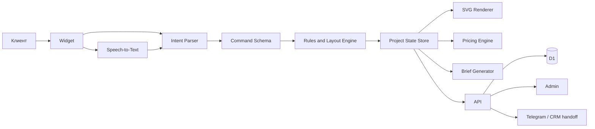
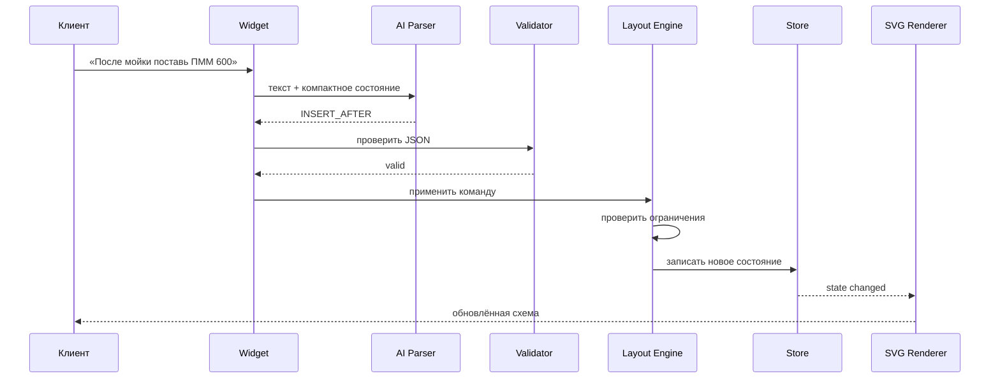

# ARCHITECTURE — MebelFlow AI

## 1. Общая схема



## 2. Вариант B

Pascal Editor не встраивается как готовый интерфейс.

Используются только идеи или совместимые пакеты:

- node-based state;
- строгие схемы;
- create/update/delete;
- undo/redo;
- metadata;
- plugin-like registration;
- единый объектный store.

Визуализация выполняется собственным SVG Renderer.

## 3. Модули

### `project-state`

Источник истины для текущей схемы.

Отвечает за:

- стену;
- размеры;
- модули;
- верхний и нижний ряд;
- стиль;
- цену;
- этап;
- предупреждения;
- историю версий.

### `command-schema`

Белый список действий.

Примеры:

- `ADD_MODULE`;
- `REMOVE_MODULE`;
- `MOVE_MODULE`;
- `INSERT_BEFORE`;
- `INSERT_AFTER`;
- `CHANGE_WIDTH`;
- `SET_ROOM_HEIGHT`;
- `SET_WALL_WIDTH`;
- `SET_APRON_HEIGHT`;
- `GENERATE_UPPER_ROW`;
- `SET_MEZZANINE_HEIGHT`;
- `APPLY_STYLE`;
- `UNDO`;
- `REDO`.

### `intent-parser`

Преобразует естественную речь в команду.

Не изменяет Project State напрямую.

### `layout-engine`

Применяет команды и проверяет:

- допустимые размеры;
- сумму ширин;
- положение;
- пересечения;
- свободное место;
- правила техники;
- верхний ряд;
- антресоли;
- технологические зазоры.

### `svg-renderer`

Рисует:

- фронтальный вид;
- размеры;
- подписи;
- фасады;
- технику;
- цвет;
- предупреждения;
- selected state.

### `pricing-engine`

Получает Project State и tenant pricing config.

Возвращает:

- минимум;
- максимум;
- разбивку;
- причины неопределённости;
- версию формулы.

### `style-presets`

Содержит:

- стиль;
- цвета;
- материалы;
- тип фасада;
- ручки;
- столешницу;
- короткое описание.

### `widget`

Публичный разговорный интерфейс.

### `admin`

Настройки компании и просмотр лидов.

### `api`

Сессии, команды, проекты, лиды, PDF, настройки.

## 4. Главный поток команды



## 5. Правило безопасности

LLM никогда не получает право:

- выполнить произвольный код;
- записать произвольное поле;
- задать отрицательный размер;
- создать неизвестный тип;
- изменить tenant pricing;
- подтвердить заказ;
- объявить цену окончательной.

## 6. Project State

```ts
type FurnitureProjectState = {
  schemaVersion: 1;
  id: string;
  tenantId: string;
  stage: ProjectStage;
  room: RoomState;
  lowerRow: RowState;
  upperRow: UpperRowState;
  style: StyleState;
  pricing: PricingState;
  warnings: ProjectWarning[];
  historyMeta: HistoryMeta;
};
```

## 7. Pascal compatibility layer

Создать адаптер, а не зависеть от внутренних деталей Pascal:

```ts
interface SceneStoreAdapter {
  createNode(node: FurnitureNode): void;
  updateNode(id: string, patch: Partial<FurnitureNode>): void;
  deleteNode(id: string): void;
  getNode(id: string): FurnitureNode | undefined;
  listNodes(): FurnitureNode[];
  undo(): void;
  redo(): void;
}
```

Первая реализация может использовать Zustand/Zundo. Позже возможно подключить `@pascal-app/core`, если он проходит spike и не утяжеляет приложение.

## 8. Хранилище

### D1

- tenants;
- tenant_settings;
- sessions;
- project_states;
- leads;
- events;
- pricing_versions;
- style_presets;
- pdf_orders;
- abuse_counters.

### R2

- PDF;
- загруженные фотографии;
- экспортные изображения SVG/PNG;
- логотипы tenant.

## 9. Deployment

- Widget: статический CDN/landing embed;
- AI/API Gateway: Google Cloud Run без GPU;
- Intent provider: OpenAI GPT-5 mini;
- STT provider: GPT-4o mini Transcribe;
- Database/storage/queue: подключаемые production adapters; конкретный managed backend фиксируется перед deploy;
- Rate limiting: Gateway + общий distributed counter/lock;
- PDF: контролируемый renderer за tenant policy;
- Landing warmup: отдельный endpoint без AI-вызова.

Подробности и экономические ограничения: `docs/decisions/ADR-004-GPT5-MINI-CLOUD-RUN-GATEWAY.md`.

## 10. Нефункциональные требования

- first meaningful paint до 2.5 сек на среднем Android;
- widget bundle без необязательных 3D-пакетов;
- все размеры в миллиметрах;
- RU обязательно;
- KZ архитектурно предусмотрен;
- autosave после каждой принятой команды;
- восстановление сессии;
- idempotency command id;
- audit trail;
- deterministic tests.
