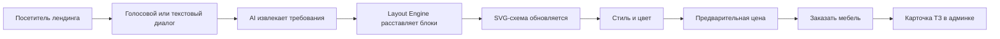

# MebelFlow AI

**AI-конструктор заявки на мебель**

MebelFlow AI — встраиваемый в лендинг мебельщика разговорный помощник. Клиент голосом или текстом описывает будущую мебель, участвует в расстановке стандартных модулей, выбирает стиль и получает предварительную стоимость. Мебельщик получает структурированное ТЗ и вовлечённого потенциального заказчика.

## Главная идея

Не заменять SketchUp, PRO100 или БАЗИС-Мебельщик.

Продукт работает **до профессионального проектирования**:



## Архитектурный выбор

Выбран **вариант B**:

- Pascal Core или совместимая узловая модель — для состояния, истории и команд;
- собственный детерминированный Layout Engine;
- собственный SVG Renderer;
- без полноценного WebGPU/3D в MVP;
- без CAD-экспорта;
- без интеграций с SketchUp и PRO100;
- обязательная проверка всех размеров алгоритмами, а не LLM.

## MVP

Первая версия поддерживает только:

- прямую кухню вдоль одной стены;
- голос и текст;
- нижний ряд;
- верхние шкафы;
- антресоли;
- базовую технику;
- простую фронтальную SVG-схему;
- стили и фасадные пресеты;
- предварительный диапазон цены;
- кнопку «Заказать мебель»;
- PDF-ТЗ по настройке мебельщика.

## Документы

- [`FOUNDATION.md`](FOUNDATION.md) — неизменяемые продуктовые принципы.
- [`PRODUCT.md`](PRODUCT.md) — продукт и пользовательская ценность.
- [`TECH_SPEC.md`](TECH_SPEC.md) — полное техническое задание.
- [`ARCHITECTURE.md`](ARCHITECTURE.md) — архитектура и границы модулей.
- [`ROADMAP.md`](ROADMAP.md) — этапы разработки.
- [`STAGE_CHECKLIST.md`](STAGE_CHECKLIST.md) — контроль выполнения.
- [`PROJECT_PROGRESS.md`](PROJECT_PROGRESS.md) — текущий прогресс.
- [`AGENTS.md`](AGENTS.md) — правила работы кодера и AI-агентов.
- [`SESSION_NOTES.md`](SESSION_NOTES.md) — журнал решений.
- [`REUSE_AUDIT.md`](REUSE_AUDIT.md) — что взять из существующих репозиториев.
- [`skills/mebelflow-conversational-interface/SKILL.md`](skills/mebelflow-conversational-interface/SKILL.md) — специализированный навык создания и ревью клиентского интерфейса.
- [`docs/decisions/ADR-001-PASCAL-CORE-SVG.md`](docs/decisions/ADR-001-PASCAL-CORE-SVG.md) — выбор варианта B.
- [`docs/decisions/ADR-002-NO-CAD-IN-MVP.md`](docs/decisions/ADR-002-NO-CAD-IN-MVP.md) — отказ от CAD-интеграций.
- [`docs/flows/USER_FLOW.md`](docs/flows/USER_FLOW.md) — пользовательские сценарии.
- [`docs/templates/FURNITURE_PROJECT_STATE.example.json`](docs/templates/FURNITURE_PROJECT_STATE.example.json) — пример состояния проекта.

## Рекомендуемое имя репозитория

```text
mebelflow-ai
```

## Рекомендуемый стек MVP

- TypeScript;
- React;
- SVG;
- Zustand или совместимый слой состояния;
- Zod;
- Cloudflare Pages/Workers;
- D1;
- R2 только для изображений и PDF;
- OpenAI-compatible AI provider abstraction;
- Speech-to-Text как отдельный сервис;
- Playwright для e2e;
- Vitest для unit-тестов.

## Главный критерий успеха

Не красота визуализации, а конверсия:

> посетитель прошёл диалог, увидел свою компоновку, выбрал стиль, получил цену и нажал «Заказать мебель».

## Локальная разработка

```powershell
npm.cmd ci
npm.cmd run check
```

Stage 0–7 реализованы в доменных пакетах, Layout Engine, SVG Renderer, provider-neutral Intent Parser, Voice Input, Style Presets, Pricing Engine и Lead/Admin Core. Текущий набор проверок включает typecheck и 190 unit/property/snapshot/contract тестов. Реальные AI/STT/OTP/CAPTCHA/Telegram providers пока не подключены.
