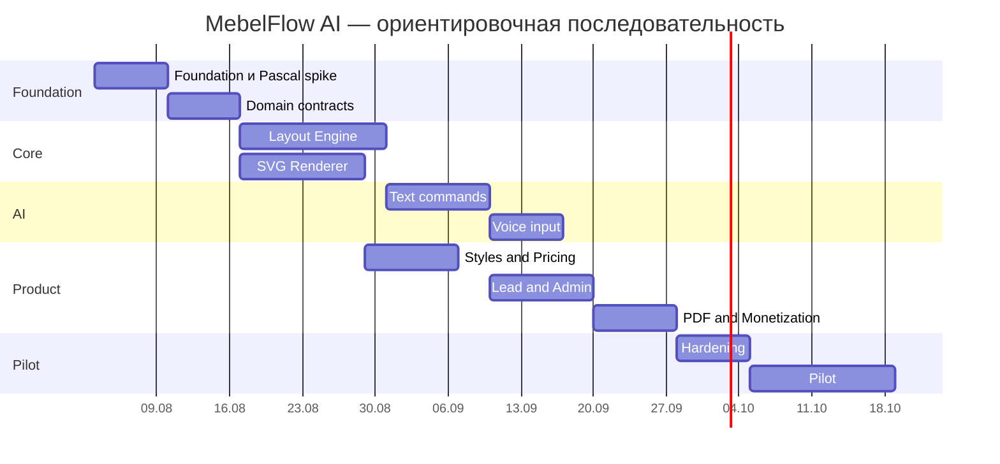

# ROADMAP — MebelFlow AI

## Этап 0. Foundation

- создать репозиторий;
- сохранить фундамент;
- провести Pascal spike;
- утвердить стек;
- выбрать источник инфраструктурных модулей;
- создать прогресс-дашборд.

## Этап 1. Domain Core

- Project State v1;
- Furniture Node schemas;
- Command Schema v1;
- unit normalization;
- reducer;
- undo/redo;
- deterministic validation;
- unit tests.

## Этап 2. Layout Engine

- прямая стена;
- нижние модули;
- стандартные ширины;
- insert before/after;
- move;
- delete;
- остаток;
- добор;
- верхний ряд;
- антресоли;
- предупреждения.

## Этап 3. SVG Renderer

- фронтальная схема;
- размеры;
- подписи;
- техника;
- selected state;
- предупреждения;
- цвета;
- responsive mobile;
- export PNG/SVG.

## Этап 4. Text Conversation

- prompt contract;
- AI provider abstraction;
- intent parser;
- validation;
- clarification;
- compact context;
- safe command execution;
- conversation UI.

## Этап 5. Voice

- Speech-to-Text;
- microphone permissions;
- transcript preview;
- confidence;
- retries;
- mobile testing;
- cost counters.

## Этап 6. Styles and Pricing

- style presets;
- facade presets;
- tenant material options;
- pricing strategies;
- breakdown;
- uncertainty;
- price versioning.

## Этап 7. Lead and Admin

- contact capture;
- OTP/CAPTCHA;
- lead card;
- events;
- Telegram;
- tenant settings;
- status pipeline;
- session resume.

## Этап 8. PDF and Monetization

- brief template;
- free/paid policy;
- payment adapter boundary;
- credit to order;
- download controls;
- storage;
- audit.

## Этап 9. Pilot

- one tenant;
- one landing;
- real mobile users;
- funnel analytics;
- AI cost;
- abandonment;
- qualitative interviews;
- fix critical issues.

## Этап 10. Expansion Decision

Только по результатам пилота решить:

- угловые кухни;
- шкафы;
- WhatsApp inbound;
- KZ;
- lightweight pseudo-3D;
- Pascal packages deeper adoption;
- CRM integrations.

