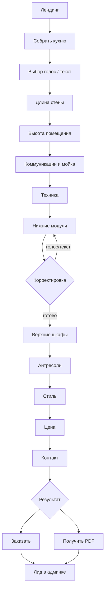
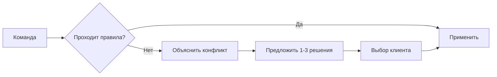

# USER FLOW

## Основной поток

## Возврат к прошлому шагу

Клиент может:

- сказать «назад»;
- сказать «верни предыдущий вариант»;
- нажать undo;
- открыть этап прогресса.

## Ошибка размера

## Abandonment recovery

- autosave;
- короткая ссылка;
- восстановление по телефону;
- напоминание только с согласием;
- не требовать регистрацию в начале.
